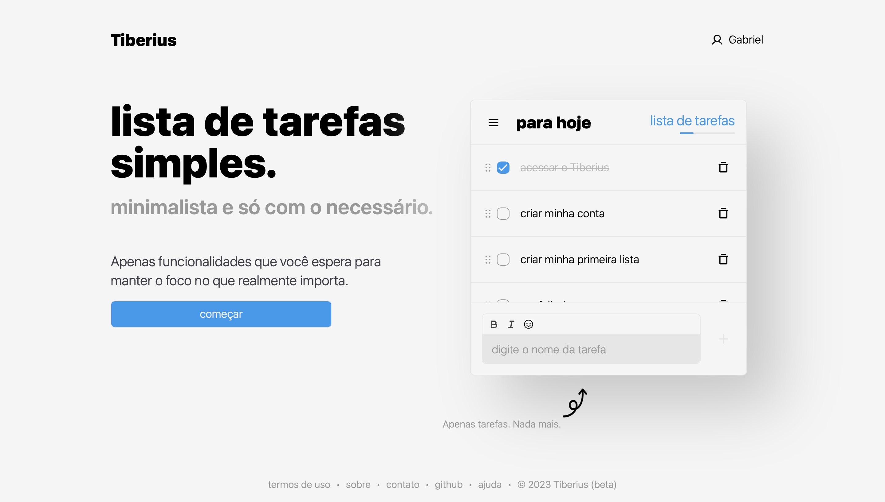

# tiberius

> Concentre-se no presente, pois é um presente que você recebeu.

Tiberius é um aplicativo de gerenciamento de tarefas projetado para ajudá-lo a se concentrar no presente e realizar suas tarefas diárias com mais eficiência. Com o Tiberius, você pode organizar suas tarefas, definir prazos, prioridades e categorias, e receber notificações para concluir suas tarefas no prazo.

 

